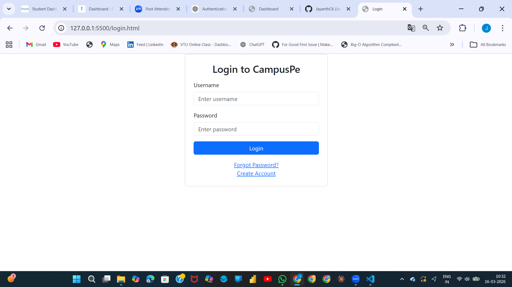
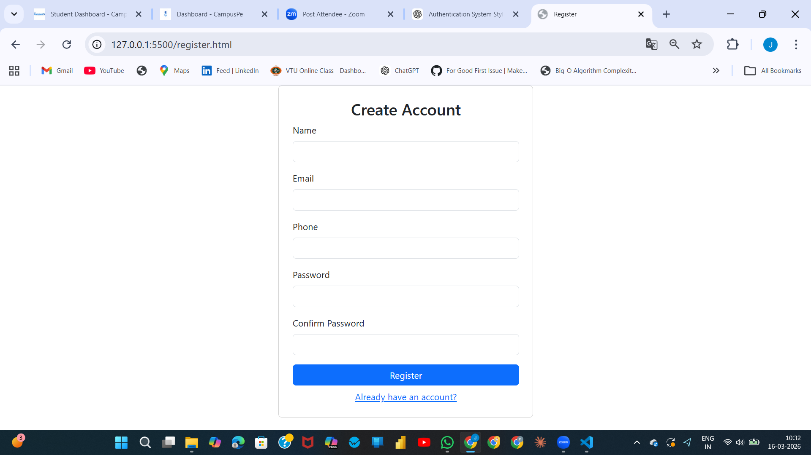
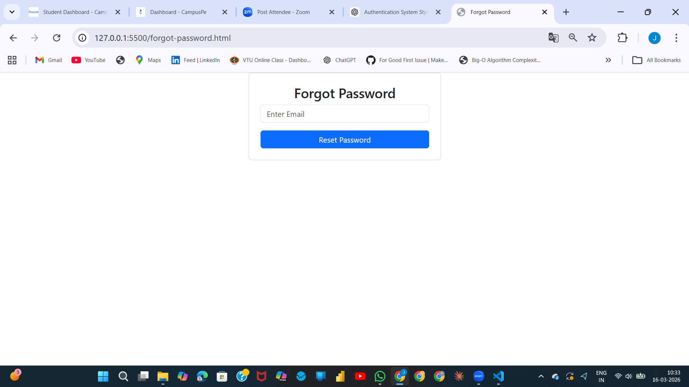
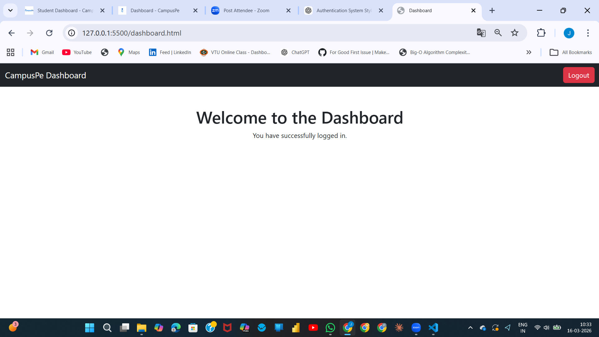

# CampusPe Authentication System (Bootstrap 5)

This project is a responsive authentication flow built with HTML, Bootstrap 5, Bootstrap Icons, and custom CSS.

## Pages Included

- `index.html` - Login page
- `register.html` - Registration page
- `forgot-password.html` - Forgot password page
- `reset-password.html` - Reset password page
- `dashboard.html` - Dashboard page

## Styling and UI Features

- Bootstrap 5 CDN integrated on all pages
- Bootstrap JavaScript bundle integrated on all pages
- Bootstrap Icons integrated for UI enhancements
- Custom `styles.css` with:
	- custom color scheme
	- Google Fonts integration
	- button and link hover effects
	- card box shadows
	- gradient background styling
	- custom spacing and smooth transitions
- Fully responsive layouts for desktop, laptop, tablet, and mobile

## Screenshots

### Login Page

### Registration Page

### Forgot Password Page

### Reset Password Page

### Dashboard

## Notes

- `login.html` is kept in the repository for compatibility.
- Main login entry page for this assignment is `index.html`.